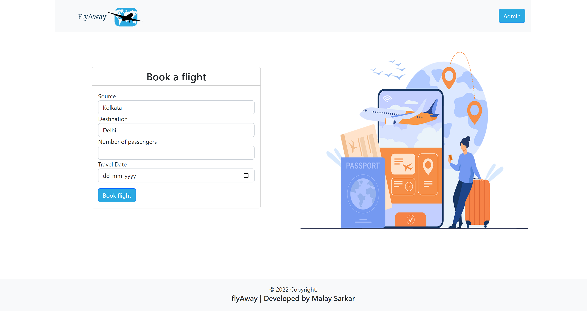

# FlyAway Ticket Booking Web Application in JAVA - Servlet, JSP, Hibernate
## Table of contents
* [General info](#general-info)
* [Using the application](#using-the-application)
* [Technologies](#technologies)
* [Live Demo](#Live-Demo)
* [Setup](#setup)
* [Coming Up](#coming-up)

## General info
A small flight Ticket booking demo project with Admin panel in <b>JAVA</b> 

## Using the application
The home page displays the application name (FlyAway) and two options - Book Flights and Admin Panel Access

  
<b>Book Flights</b>  -  
The user enters flight details (date, source, destination, travellers). 
A query is sent to the remote database to fetch related flights and displayed to user.
The User enters other details and proceeds to book the flight and finally can print the ticket.
  
<b>Admin</b>  -  
User can register as Admin.
Admin dashboard is accessed by logging in as admin .
Admin can do the followings :  
  * add a flight  
  * see master-flight-list 
  * change password after logging in 
  * find the booking history with customer details 
  * logout 

## Technologies
<b>Frontend</b> - JSP, HTML, CSS, Bootstrap  
<b>Backend</b> - JAVA Servlets  
<b>Session Management</b> - Http Session  
<b>Database</b> - MySQL , Hibernate - Hosted on a remote server at AWS EC2  
<b>Application Server</b>  - Tomcat 8.5 with Corretto 18 running on 64bit Ubuntu 22.04 on AWS EC2  

## Live Demo
Application is hosted here - http://13.234.84.77:8080/FlyAway/index.html

## Setup
To run in your localhost - Clone into local and run project on tomcat server. If any issue check artifact is build properly. also check the database config and java version
 
Check screenshots for tomcat configuration
  
To deploy on a server use FlyAway.war file.

## Coming Up
1. Form/Input Validation
2. Better CSS/Frontend Styles
3. Customer authentication
3. Admin defined Airports and many more

